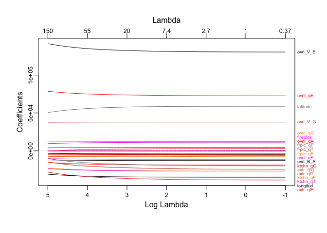

P8106 HW1
================
Lin Yang

``` r
library(tidyverse)
library(glmnet)
```

## Import the training data and test data

``` r
train <- read.csv("data/housing_training.csv") %>% 
  janitor::clean_names()
train <- na.omit(train)
    


test <- read.csv("data/housing_test.csv") %>% 
  janitor::clean_names()
test <- na.omit(test)
```

## least squares

``` r
fit_ls <- lm(sale_price ~ ., data = train)
summary(fit_ls)
```

    ## 
    ## Call:
    ## lm(formula = sale_price ~ ., data = train)
    ## 
    ## Residuals:
    ##    Min     1Q Median     3Q    Max 
    ## -89864 -12424    416  12143 140205 
    ## 
    ## Coefficients: (1 not defined because of singularities)
    ##                              Estimate Std. Error t value Pr(>|t|)    
    ## (Intercept)                -4.985e+06  3.035e+06  -1.642  0.10076    
    ## gr_liv_area                 2.458e+01  1.393e+01   1.765  0.07778 .  
    ## first_flr_sf                4.252e+01  1.409e+01   3.017  0.00260 ** 
    ## second_flr_sf               4.177e+01  1.379e+01   3.029  0.00250 ** 
    ## total_bsmt_sf               3.519e+01  2.744e+00  12.827  < 2e-16 ***
    ## low_qual_fin_sf                    NA         NA      NA       NA    
    ## wood_deck_sf                1.202e+01  4.861e+00   2.474  0.01350 *  
    ## open_porch_sf               1.618e+01  1.004e+01   1.611  0.10736    
    ## bsmt_unf_sf                -2.087e+01  1.723e+00 -12.116  < 2e-16 ***
    ## mas_vnr_area                1.046e+01  4.229e+00   2.473  0.01353 *  
    ## garage_cars                 4.229e+03  1.893e+03   2.234  0.02563 *  
    ## garage_area                 7.769e+00  6.497e+00   1.196  0.23195    
    ## year_built                  3.251e+02  3.130e+01  10.388  < 2e-16 ***
    ## tot_rms_abv_grd            -3.838e+03  6.922e+02  -5.545 3.51e-08 ***
    ## full_bath                  -4.341e+03  1.655e+03  -2.622  0.00883 ** 
    ## overall_qualAverage        -5.013e+03  1.735e+03  -2.890  0.00391 ** 
    ## overall_qualBelow_Average  -1.280e+04  2.677e+03  -4.782 1.92e-06 ***
    ## overall_qualExcellent       7.261e+04  5.381e+03  13.494  < 2e-16 ***
    ## overall_qualFair           -1.115e+04  5.240e+03  -2.127  0.03356 *  
    ## overall_qualGood            1.226e+04  1.950e+03   6.287 4.30e-10 ***
    ## overall_qualVery_Excellent  1.304e+05  8.803e+03  14.810  < 2e-16 ***
    ## overall_qualVery_Good       3.798e+04  2.741e+03  13.852  < 2e-16 ***
    ## kitchen_qualFair           -2.663e+04  6.325e+03  -4.210 2.71e-05 ***
    ## kitchen_qualGood           -1.879e+04  4.100e+03  -4.582 5.01e-06 ***
    ## kitchen_qualTypical        -2.677e+04  4.281e+03  -6.252 5.37e-10 ***
    ## fireplaces                  1.138e+04  2.257e+03   5.043 5.18e-07 ***
    ## fireplace_quFair           -7.207e+03  6.823e+03  -1.056  0.29106    
    ## fireplace_quGood            6.070e+02  5.833e+03   0.104  0.91713    
    ## fireplace_quNo_Fireplace    3.394e+03  6.298e+03   0.539  0.59002    
    ## fireplace_quPoor           -5.185e+03  7.399e+03  -0.701  0.48362    
    ## fireplace_quTypical        -6.398e+03  5.897e+03  -1.085  0.27814    
    ## exter_qualFair             -3.854e+04  8.383e+03  -4.598 4.66e-06 ***
    ## exter_qualGood             -1.994e+04  5.585e+03  -3.569  0.00037 ***
    ## exter_qualTypical          -2.436e+04  5.874e+03  -4.147 3.57e-05 ***
    ## lot_frontage                1.024e+02  1.905e+01   5.376 8.90e-08 ***
    ## lot_area                    6.042e-01  7.864e-02   7.683 2.91e-14 ***
    ## longitude                  -3.481e+04  2.537e+04  -1.372  0.17016    
    ## latitude                    5.874e+04  3.483e+04   1.686  0.09193 .  
    ## misc_val                    9.171e-01  1.003e+00   0.914  0.36071    
    ## year_sold                  -6.455e+02  4.606e+02  -1.401  0.16132    
    ## ---
    ## Signif. codes:  0 '***' 0.001 '**' 0.01 '*' 0.05 '.' 0.1 ' ' 1
    ## 
    ## Residual standard error: 22190 on 1401 degrees of freedom
    ## Multiple R-squared:  0.9116, Adjusted R-squared:  0.9092 
    ## F-statistic: 380.3 on 38 and 1401 DF,  p-value: < 2.2e-16

## Lasso

### Fit lasso model

``` r
x <- model.matrix(sale_price ~ ., train)[ ,-1]
y <- train$sale_price
fit_lasso <- glmnet(x = x,
                    y = y,
                    standardize = TRUE,
                    alpha = 1,
                    lambda = exp(seq(5, -1, length = 100)))


mat.coef <- coef(fit_lasso)
dim(mat.coef)
```

    ## [1]  40 100

### Cross-validation for lasso

``` r
set.seed(1234)
cv.lasso <- cv.glmnet(x, y,
                      alpha = 1, 
                      lambda = exp(seq(7, -1, length = 100)))

plot(cv.lasso)#cv curve
abline(h = (cv.lasso$cvm + cv.lasso$cvsd)[which.min(cv.lasso$cvm)], col = 4, lwd = 2)
```

<!-- -->

``` r
cv.lasso$lambda.min
```

    ## [1] 39.91965

``` r
cv.lasso$lambda.1se
```

    ## [1] 793.7493

### Coefficients of the final lasso model

``` r
coef = predict(cv.lasso, s = cv.lasso$lambda.1se, type = "coefficients")
num_pred = length(which(coef != 0)) - 1
```

There are 30 predictors in this model.

``` r
train <- read.csv("data/housing_training.csv") %>% 
  janitor::clean_names() %>% 
  mutate(
    overall_qual = factor(overall_qual,
                          levels = c("Very_Excellent", "Excellent", "Very_Good", "Good", "Above_Average", "Average", "Below_Average", "Fair"),
                          labels = c("0", "1", "2", "3", "4", "5", "6", "7")),
    kitchen_qual = factor(kitchen_qual,
                               levels = c("Excellent", "Good", "Typical", "Fair"),
                               labels = c("0", "1", "2", "3")),
    fireplace_qu = factor(fireplace_qu,
                          levels = c("Excellent", "Good", "Typical", "Fair", "Poor", "No_Fireplace"),
                          labels = c("0", "1", "2", "3", "4", "5")),
    exter_qual = factor(exter_qual,
                        levels = c("Excellent", "Good", "Typical", "Fair", "Poor"),
                        labels = c("0", "1", "2", "3", "4")))
    


test <- read.csv("data/housing_test.csv") %>% 
  janitor::clean_names() %>% 
  mutate(
    overall_qual = factor(overall_qual,
                          levels = c("Very_Excellent", "Excellent", "Very_Good", "Good", "Above_Average", "Average", "Below_Average", "Fair"),
                          labels = c("0", "1", "2", "3", "4", "5", "6", "7")),
    kitchen_qual = factor(kitchen_qual,
                               levels = c("Excellent", "Good", "Typical", "Fair"),
                               labels = c("0", "1", "2", "3")),
    fireplace_qu = factor(fireplace_qu,
                          levels = c("Excellent", "Good", "Typical", "Fair", "Poor", "No_Fireplace"),
                          labels = c("0", "1", "2", "3", "4", "5")),
    exter_qual = factor(exter_qual,
                        levels = c("Excellent", "Good", "Typical", "Fair", "Poor"),
                        labels = c("0", "1", "2", "3", "4")))
```
