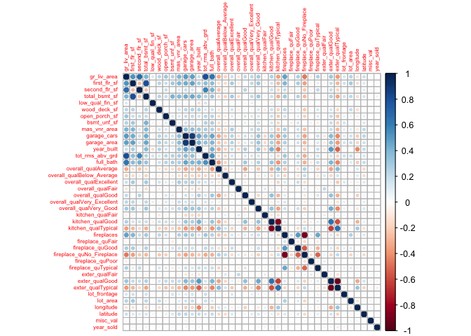
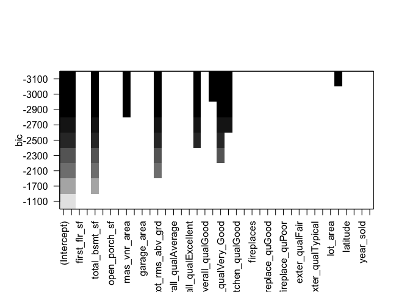
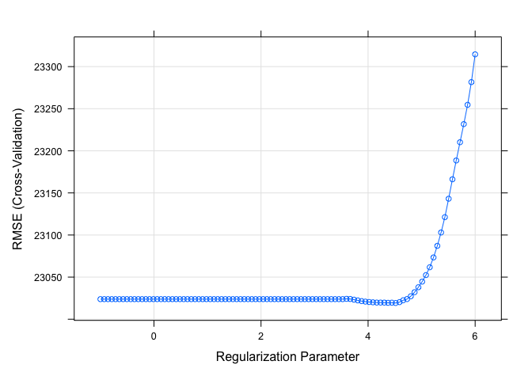
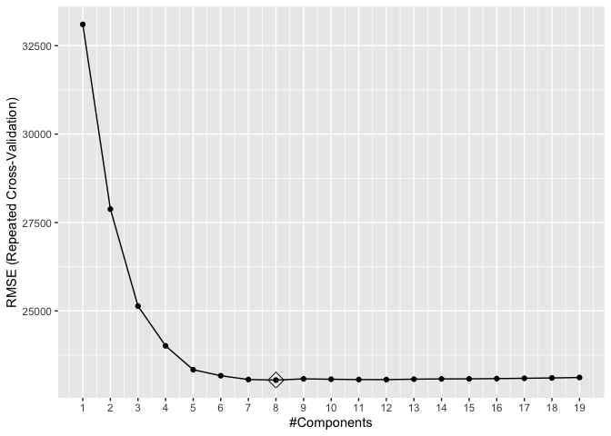
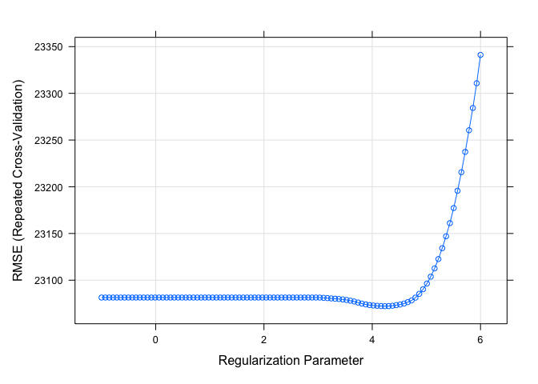

P8106 HW1
================
Lin Yang

``` r
library(tidyverse)
library(corrplot)
library(leaps)
library(glmnet)
library(plotmo)
library(caret)
library(pls)
```

## Import the training data and test data

``` r
train <- read.csv("data/housing_training.csv") %>% 
  janitor::clean_names()
train <- na.omit(train)


test <- read.csv("data/housing_test.csv") %>% 
  janitor::clean_names()
test <- na.omit(test)
```

## Least squares

We first fit a linear model on the training data using least squares and
cross-validation.

``` r
ctrl1 <- trainControl(method = "repeatedcv", number = 10, repeats = 5)
x <- model.matrix(sale_price ~ ., train)[ ,-1]
y <- train$sale_price
x_test <- model.matrix(sale_price ~ ., test)[ ,-1]
y_test <- test$sale_price

set.seed(1234)
fit.lm <- train(x, y, 
             method = "lm",
             trControl = ctrl1)
summary(fit.lm)
```

    ## 
    ## Call:
    ## lm(formula = .outcome ~ ., data = dat)
    ## 
    ## Residuals:
    ##    Min     1Q Median     3Q    Max 
    ## -89864 -12424    416  12143 140205 
    ## 
    ## Coefficients: (1 not defined because of singularities)
    ##                              Estimate Std. Error t value Pr(>|t|)    
    ## (Intercept)                -4.985e+06  3.035e+06  -1.642  0.10076    
    ## gr_liv_area                 2.458e+01  1.393e+01   1.765  0.07778 .  
    ## first_flr_sf                4.252e+01  1.409e+01   3.017  0.00260 ** 
    ## second_flr_sf               4.177e+01  1.379e+01   3.029  0.00250 ** 
    ## total_bsmt_sf               3.519e+01  2.744e+00  12.827  < 2e-16 ***
    ## low_qual_fin_sf                    NA         NA      NA       NA    
    ## wood_deck_sf                1.202e+01  4.861e+00   2.474  0.01350 *  
    ## open_porch_sf               1.618e+01  1.004e+01   1.611  0.10736    
    ## bsmt_unf_sf                -2.087e+01  1.723e+00 -12.116  < 2e-16 ***
    ## mas_vnr_area                1.046e+01  4.229e+00   2.473  0.01353 *  
    ## garage_cars                 4.229e+03  1.893e+03   2.234  0.02563 *  
    ## garage_area                 7.769e+00  6.497e+00   1.196  0.23195    
    ## year_built                  3.251e+02  3.130e+01  10.388  < 2e-16 ***
    ## tot_rms_abv_grd            -3.838e+03  6.922e+02  -5.545 3.51e-08 ***
    ## full_bath                  -4.341e+03  1.655e+03  -2.622  0.00883 ** 
    ## overall_qualAverage        -5.013e+03  1.735e+03  -2.890  0.00391 ** 
    ## overall_qualBelow_Average  -1.280e+04  2.677e+03  -4.782 1.92e-06 ***
    ## overall_qualExcellent       7.261e+04  5.381e+03  13.494  < 2e-16 ***
    ## overall_qualFair           -1.115e+04  5.240e+03  -2.127  0.03356 *  
    ## overall_qualGood            1.226e+04  1.950e+03   6.287 4.30e-10 ***
    ## overall_qualVery_Excellent  1.304e+05  8.803e+03  14.810  < 2e-16 ***
    ## overall_qualVery_Good       3.798e+04  2.741e+03  13.852  < 2e-16 ***
    ## kitchen_qualFair           -2.663e+04  6.325e+03  -4.210 2.71e-05 ***
    ## kitchen_qualGood           -1.879e+04  4.100e+03  -4.582 5.01e-06 ***
    ## kitchen_qualTypical        -2.677e+04  4.281e+03  -6.252 5.37e-10 ***
    ## fireplaces                  1.138e+04  2.257e+03   5.043 5.18e-07 ***
    ## fireplace_quFair           -7.207e+03  6.823e+03  -1.056  0.29106    
    ## fireplace_quGood            6.070e+02  5.833e+03   0.104  0.91713    
    ## fireplace_quNo_Fireplace    3.394e+03  6.298e+03   0.539  0.59002    
    ## fireplace_quPoor           -5.185e+03  7.399e+03  -0.701  0.48362    
    ## fireplace_quTypical        -6.398e+03  5.897e+03  -1.085  0.27814    
    ## exter_qualFair             -3.854e+04  8.383e+03  -4.598 4.66e-06 ***
    ## exter_qualGood             -1.994e+04  5.585e+03  -3.569  0.00037 ***
    ## exter_qualTypical          -2.436e+04  5.874e+03  -4.147 3.57e-05 ***
    ## lot_frontage                1.024e+02  1.905e+01   5.376 8.90e-08 ***
    ## lot_area                    6.042e-01  7.864e-02   7.683 2.91e-14 ***
    ## longitude                  -3.481e+04  2.537e+04  -1.372  0.17016    
    ## latitude                    5.874e+04  3.483e+04   1.686  0.09193 .  
    ## misc_val                    9.171e-01  1.003e+00   0.914  0.36071    
    ## year_sold                  -6.455e+02  4.606e+02  -1.401  0.16132    
    ## ---
    ## Signif. codes:  0 '***' 0.001 '**' 0.01 '*' 0.05 '.' 0.1 ' ' 1
    ## 
    ## Residual standard error: 22190 on 1401 degrees of freedom
    ## Multiple R-squared:  0.9116, Adjusted R-squared:  0.9092 
    ## F-statistic: 380.3 on 38 and 1401 DF,  p-value: < 2.2e-16

``` r
#make predictions
fit_lm_pred <- predict(fit.lm, newdata = x_test)
#test error
mean((fit_lm_pred - y_test)^2)
```

    ## [1] 447287652

``` r
#correlation plot
corrplot::corrplot(cor(x), 
         method = "circle", 
         type = "full",
         tl.cex = 0.5)
```

<!-- -->

The least squares linear model is easy to fit, and the least squares
estimates are BLUE. However, correlations amongst predictors can cause
problems. From the above correlation plot, we can see that some
predictors are highly correlated with each other, for example,
`garage_area` and `garage_cars`. Due to multicollinearity, the variance
of coefficients tends to increase and interpretations would be
difficult.

We then did a best subset model selection, the predictors selected to
give the smallest BIC are `gr_liv_area`, `total_bsmt_sf`,
`mas_vnr_area`, `tot_rms_abv_grd`, `overall_qualFair`,
`overall_qualVery_Excellent`, `overall_qualVery_Good`,
`kitcehn_qualFair`and `longitude`.

``` r
regsubsetsObj <- regsubsets(sale_price ~ .,
                            data = train,
                            method = "exhaustive", nbest = 1) 
```

    ## Reordering variables and trying again:

``` r
plot(regsubsetsObj, scale = "bic")
```

<!-- -->

## Lasso

``` r
set.seed(1234)
#lasso model with min mse
lasso.fit.min <- train(x, y,
                   method = "glmnet",
                   tuneGrid = expand.grid(alpha = 1, 
                                          lambda = exp(seq(6, -1, length = 100))),
                   trControl = ctrl1)
plot(lasso.fit.min, xTrans = log)
```

<!-- -->

``` r
#optimal tuning parameters
lasso.fit.min$bestTune
```

    ##    alpha   lambda
    ## 75     1 68.87706

``` r
#test error
lasso_pred_min <- predict(lasso.fit.min, newdata = x_test)
mean((lasso_pred_min - y_test)^2)
```

    ## [1] 439638183

``` r
#coefficients
coef(lasso.fit.min$finalModel, lasso.fit.min$bestTune$lambda)
```

    ## 40 x 1 sparse Matrix of class "dgCMatrix"
    ##                                       s1
    ## (Intercept)                -4.819134e+06
    ## gr_liv_area                 6.533715e+01
    ## first_flr_sf                8.047852e-01
    ## second_flr_sf               .           
    ## total_bsmt_sf               3.542815e+01
    ## low_qual_fin_sf            -4.088896e+01
    ## wood_deck_sf                1.161446e+01
    ## open_porch_sf               1.539102e+01
    ## bsmt_unf_sf                -2.088676e+01
    ## mas_vnr_area                1.092232e+01
    ## garage_cars                 4.076890e+03
    ## garage_area                 8.186225e+00
    ## year_built                  3.232282e+02
    ## tot_rms_abv_grd            -3.605069e+03
    ## full_bath                  -3.815672e+03
    ## overall_qualAverage        -4.843987e+03
    ## overall_qualBelow_Average  -1.243832e+04
    ## overall_qualExcellent       7.562416e+04
    ## overall_qualFair           -1.072979e+04
    ## overall_qualGood            1.211203e+04
    ## overall_qualVery_Excellent  1.359412e+05
    ## overall_qualVery_Good       3.788423e+04
    ## kitchen_qualFair           -2.474792e+04
    ## kitchen_qualGood           -1.711939e+04
    ## kitchen_qualTypical        -2.523695e+04
    ## fireplaces                  1.050261e+04
    ## fireplace_quFair           -7.656107e+03
    ## fireplace_quGood            .           
    ## fireplace_quNo_Fireplace    1.371432e+03
    ## fireplace_quPoor           -5.631008e+03
    ## fireplace_quTypical        -7.009951e+03
    ## exter_qualFair             -3.311445e+04
    ## exter_qualGood             -1.488441e+04
    ## exter_qualTypical          -1.932398e+04
    ## lot_frontage                9.950053e+01
    ## lot_area                    6.042233e-01
    ## longitude                  -3.283930e+04
    ## latitude                    5.488323e+04
    ## misc_val                    8.230881e-01
    ## year_sold                  -5.559416e+02

``` r
#lasso model applying 1SE
ctrl2 <- trainControl(method = "cv", selectionFunction = "oneSE")
set.seed(1234)
lasso.fit.1se <- train(x, y,
                   method = "glmnet",
                   tuneGrid = expand.grid(alpha = 1, 
                                          lambda = exp(seq(6, -1, length = 100))),
                   trControl = ctrl2)
plot(lasso.fit.1se, xTrans = log)
```

<!-- -->

``` r
#optimal tuning parameters
lasso.fit.1se$bestTune
```

    ##     alpha   lambda
    ## 100     1 403.4288

``` r
#test error
lasso_pred_1se <- predict(lasso.fit.1se, newdata = x_test)
mean((lasso_pred_1se - y_test)^2)
```

    ## [1] 420726548

``` r
#coefficients
coeff <- coef(lasso.fit.1se$finalModel, lasso.fit.1se$bestTune$lambda)
num_pred = length(which(coeff != 0)) - 1
num_pred
```

    ## [1] 36

By fitting lasso models, the lambda with the minimal MSE is 68.8770639,
and the lambda with 1SE rule is 403.4287935. The model with lambda.min
gives a test error, 4.3963818^{8}, and the model with lambda.1se gives a
test error, 4.2072655^{8} which is smaller, so 1 SE rule may be applied
in this model. When 1SE rule is applied, 36 predictors are included in
this model. The coefficients of predictors are shown above.

## Elastic net

### Fit elastic net model

``` r
set.seed(1234)
fit.enet <- train(x, y,
                  method = "glmnet",
                  tuneGrid = expand.grid(alpha = seq(0, 1, length = 21),
                                         lambda = exp(seq(8, -2, length = 50))),
                  trControl = ctrl1)
#best tuning parameters
fit.enet$bestTune
```

    ##    alpha   lambda
    ## 93  0.05 714.3897

``` r
myCol <- rainbow(25)
myPar <- list(superpose.symbol = list(col = myCol),
                    superpose.line = list(col = myCol))
#plot of RMSE vs lambda
plot(fit.enet, par.settings = myPar)
```

<!-- -->

``` r
#make predictions
enet_pred <- predict(fit.enet, newdata = x_test)
#test error
mean((enet_pred - y_test)^2)
```

    ## [1] 437161231

``` r
coef(fit.enet$finalModel, fit.enet$bestTune$lambda)
```

    ## 40 x 1 sparse Matrix of class "dgCMatrix"
    ##                                       s1
    ## (Intercept)                -5.143330e+06
    ## gr_liv_area                 3.857457e+01
    ## first_flr_sf                2.660581e+01
    ## second_flr_sf               2.524578e+01
    ## total_bsmt_sf               3.488416e+01
    ## low_qual_fin_sf            -1.593502e+01
    ## wood_deck_sf                1.239833e+01
    ## open_porch_sf               1.702473e+01
    ## bsmt_unf_sf                -2.068247e+01
    ## mas_vnr_area                1.189557e+01
    ## garage_cars                 4.019474e+03
    ## garage_area                 9.111479e+00
    ## year_built                  3.177757e+02
    ## tot_rms_abv_grd            -3.362468e+03
    ## full_bath                  -3.577411e+03
    ## overall_qualAverage        -5.132906e+03
    ## overall_qualBelow_Average  -1.268017e+04
    ## overall_qualExcellent       7.624393e+04
    ## overall_qualFair           -1.152272e+04
    ## overall_qualGood            1.190041e+04
    ## overall_qualVery_Excellent  1.372152e+05
    ## overall_qualVery_Good       3.753924e+04
    ## kitchen_qualFair           -2.314523e+04
    ## kitchen_qualGood           -1.561811e+04
    ## kitchen_qualTypical        -2.367917e+04
    ## fireplaces                  1.070460e+04
    ## fireplace_quFair           -7.908657e+03
    ## fireplace_quGood            1.177879e+02
    ## fireplace_quNo_Fireplace    1.556979e+03
    ## fireplace_quPoor           -5.851370e+03
    ## fireplace_quTypical        -6.995778e+03
    ## exter_qualFair             -3.215988e+04
    ## exter_qualGood             -1.376248e+04
    ## exter_qualTypical          -1.842191e+04
    ## lot_frontage                9.967381e+01
    ## lot_area                    6.025529e-01
    ## longitude                  -3.529057e+04
    ## latitude                    5.758090e+04
    ## misc_val                    8.566244e-01
    ## year_sold                  -5.613626e+02

The optimal tuning parameters are selected to be alpha = 0.05 and lambda
= 714.3896712. The test error of this elastic net model is
4.3716123^{8}. The coefficients of this model are shown above.

## Partial least squares

``` r
set.seed(1234)
pls.fit <- train(x, y,
                 method = "pls",
                 tuneGrid  = data.frame(ncomp = 1:19),
                 trControl = ctrl1,
                 preProcess = c("center", "scale"))


ggplot(pls.fit, highlight = TRUE) +
  scale_x_continuous(breaks = seq(0,20,1))
```

<!-- -->

``` r
#make predictions
pls_pred <- predict(pls.fit, newdata = x_test)
#test error
mean((pls_pred - y_test)^2)
```

    ## [1] 440217938

Based on the plot, 8 components are included in this pls model which
gives the least cv rmsep. And the test error of this model is
4.4021794^{8}.

## Model comparison

``` r
set.seed(1234)
resamp <- resamples(list(lm = fit.lm, lasso = lasso.fit.min, enet = fit.enet, pls = pls.fit))
summary(resamp)
```

    ## 
    ## Call:
    ## summary.resamples(object = resamp)
    ## 
    ## Models: lm, lasso, enet, pls 
    ## Number of resamples: 50 
    ## 
    ## MAE 
    ##           Min.  1st Qu.   Median     Mean  3rd Qu.     Max. NA's
    ## lm    14260.19 15738.77 16883.88 16773.69 17770.39 19630.86    0
    ## lasso 14196.65 15644.74 16779.82 16702.37 17715.29 19623.58    0
    ## enet  14104.43 15566.54 16726.15 16656.97 17695.97 19574.58    0
    ## pls   14110.75 15537.70 16743.88 16648.32 17586.87 19675.05    0
    ## 
    ## RMSE 
    ##           Min.  1st Qu.   Median     Mean  3rd Qu.     Max. NA's
    ## lm    20212.65 21478.04 22810.06 23132.49 24898.20 27059.42    0
    ## lasso 20184.81 21378.68 22792.62 23072.18 24511.54 27200.14    0
    ## enet  20107.10 21370.72 22829.14 23054.78 24487.70 27213.97    0
    ## pls   20135.01 21435.03 22804.56 23044.74 24593.52 27539.43    0
    ## 
    ## Rsquared 
    ##            Min.   1st Qu.    Median      Mean   3rd Qu.      Max. NA's
    ## lm    0.8490164 0.8940725 0.9061873 0.9022587 0.9144933 0.9293063    0
    ## lasso 0.8488847 0.8946809 0.9066495 0.9026838 0.9146436 0.9287996    0
    ## enet  0.8500784 0.8946500 0.9066844 0.9028631 0.9151932 0.9284083    0
    ## pls   0.8491266 0.8937347 0.9053601 0.9029215 0.9159600 0.9292046    0

``` r
bwplot(resamp, metric = "RMSE")
```

<!-- -->

By comparing the mean RMSE, elastic net model and partial least squares
model have the smallest mean RMSE. Since the elastic net model includes
all the predictors, violating the principle of parsimony. Therefore, I
would choose the partial least squares model to be the best one
predicting the response.
