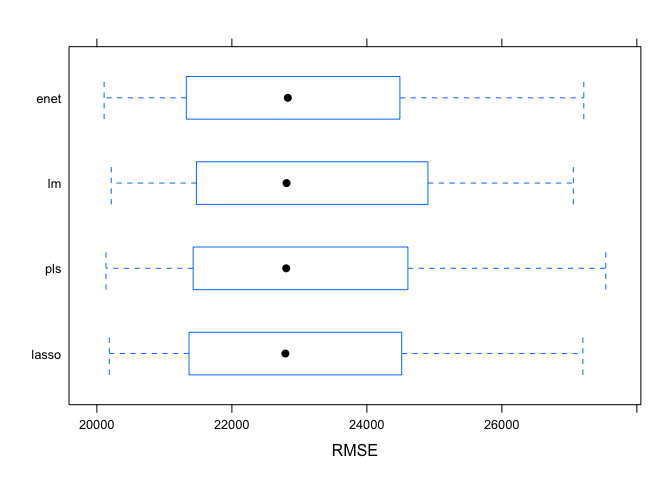
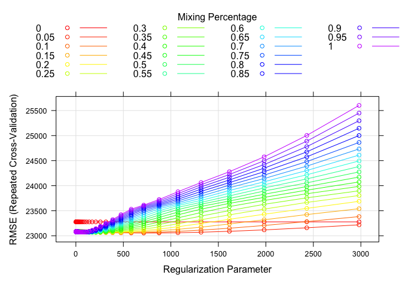
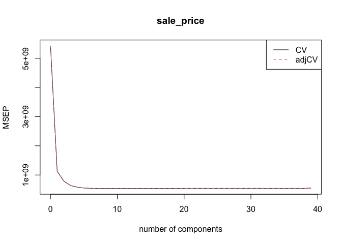

P8106 HW1
================
Lin Yang

``` r
library(tidyverse)
library(corrplot)
library(leaps)
library(glmnet)
library(plotmo)
library(caret)
library(pls)
```

## Import the training data and test data

``` r
train <- read.csv("data/housing_training.csv") %>% 
  janitor::clean_names()
train <- na.omit(train)


test <- read.csv("data/housing_test.csv") %>% 
  janitor::clean_names()
test <- na.omit(test)
```

## Least squares

We first fit a linear model on the training data using least squares and
cross-validation.

``` r
ctrl <- trainControl(method = "repeatedcv", number = 10, repeats = 5)
x <- model.matrix(sale_price ~ ., train)[ ,-1]
y <- train$sale_price

set.seed(1234)
fit_lm <- train(x, y, 
             method = "lm",
             trControl = ctrl)
summary(fit_lm)
```

    ## 
    ## Call:
    ## lm(formula = .outcome ~ ., data = dat)
    ## 
    ## Residuals:
    ##    Min     1Q Median     3Q    Max 
    ## -89864 -12424    416  12143 140205 
    ## 
    ## Coefficients: (1 not defined because of singularities)
    ##                              Estimate Std. Error t value Pr(>|t|)    
    ## (Intercept)                -4.985e+06  3.035e+06  -1.642  0.10076    
    ## gr_liv_area                 2.458e+01  1.393e+01   1.765  0.07778 .  
    ## first_flr_sf                4.252e+01  1.409e+01   3.017  0.00260 ** 
    ## second_flr_sf               4.177e+01  1.379e+01   3.029  0.00250 ** 
    ## total_bsmt_sf               3.519e+01  2.744e+00  12.827  < 2e-16 ***
    ## low_qual_fin_sf                    NA         NA      NA       NA    
    ## wood_deck_sf                1.202e+01  4.861e+00   2.474  0.01350 *  
    ## open_porch_sf               1.618e+01  1.004e+01   1.611  0.10736    
    ## bsmt_unf_sf                -2.087e+01  1.723e+00 -12.116  < 2e-16 ***
    ## mas_vnr_area                1.046e+01  4.229e+00   2.473  0.01353 *  
    ## garage_cars                 4.229e+03  1.893e+03   2.234  0.02563 *  
    ## garage_area                 7.769e+00  6.497e+00   1.196  0.23195    
    ## year_built                  3.251e+02  3.130e+01  10.388  < 2e-16 ***
    ## tot_rms_abv_grd            -3.838e+03  6.922e+02  -5.545 3.51e-08 ***
    ## full_bath                  -4.341e+03  1.655e+03  -2.622  0.00883 ** 
    ## overall_qualAverage        -5.013e+03  1.735e+03  -2.890  0.00391 ** 
    ## overall_qualBelow_Average  -1.280e+04  2.677e+03  -4.782 1.92e-06 ***
    ## overall_qualExcellent       7.261e+04  5.381e+03  13.494  < 2e-16 ***
    ## overall_qualFair           -1.115e+04  5.240e+03  -2.127  0.03356 *  
    ## overall_qualGood            1.226e+04  1.950e+03   6.287 4.30e-10 ***
    ## overall_qualVery_Excellent  1.304e+05  8.803e+03  14.810  < 2e-16 ***
    ## overall_qualVery_Good       3.798e+04  2.741e+03  13.852  < 2e-16 ***
    ## kitchen_qualFair           -2.663e+04  6.325e+03  -4.210 2.71e-05 ***
    ## kitchen_qualGood           -1.879e+04  4.100e+03  -4.582 5.01e-06 ***
    ## kitchen_qualTypical        -2.677e+04  4.281e+03  -6.252 5.37e-10 ***
    ## fireplaces                  1.138e+04  2.257e+03   5.043 5.18e-07 ***
    ## fireplace_quFair           -7.207e+03  6.823e+03  -1.056  0.29106    
    ## fireplace_quGood            6.070e+02  5.833e+03   0.104  0.91713    
    ## fireplace_quNo_Fireplace    3.394e+03  6.298e+03   0.539  0.59002    
    ## fireplace_quPoor           -5.185e+03  7.399e+03  -0.701  0.48362    
    ## fireplace_quTypical        -6.398e+03  5.897e+03  -1.085  0.27814    
    ## exter_qualFair             -3.854e+04  8.383e+03  -4.598 4.66e-06 ***
    ## exter_qualGood             -1.994e+04  5.585e+03  -3.569  0.00037 ***
    ## exter_qualTypical          -2.436e+04  5.874e+03  -4.147 3.57e-05 ***
    ## lot_frontage                1.024e+02  1.905e+01   5.376 8.90e-08 ***
    ## lot_area                    6.042e-01  7.864e-02   7.683 2.91e-14 ***
    ## longitude                  -3.481e+04  2.537e+04  -1.372  0.17016    
    ## latitude                    5.874e+04  3.483e+04   1.686  0.09193 .  
    ## misc_val                    9.171e-01  1.003e+00   0.914  0.36071    
    ## year_sold                  -6.455e+02  4.606e+02  -1.401  0.16132    
    ## ---
    ## Signif. codes:  0 '***' 0.001 '**' 0.01 '*' 0.05 '.' 0.1 ' ' 1
    ## 
    ## Residual standard error: 22190 on 1401 degrees of freedom
    ## Multiple R-squared:  0.9116, Adjusted R-squared:  0.9092 
    ## F-statistic: 380.3 on 38 and 1401 DF,  p-value: < 2.2e-16

``` r
#correlation plot
#corrplot(cor(x), 
         #method = "circle", 
         #type = "full",
         #tl.cex = 0.5)
```

The least squares linear model is easy to fit, and the least squares
estimates are BLUE. However, correlations amongst predictors can cause
problems. From the above correlation plot, we can see that some
predictors are highly correlated with each other, for example,
`garage_area` and `garage_cars`. Due to multicollinearity, the variance
of coefficients tends to increase and interpretations would be
difficult.

We then did a best subset model selection, the predictors selected to
give the smallest BIC are `gr_liv_area`, `total_bsmt_sf`,
`mas_vnr_area`, `tot_rms_abv_grd`, `overall_qualFair`,
`overall_qualVery_Excellent`, `overall_qualVery_Good`,
`kitcehn_qualFair`and `longitude`.

``` r
regsubsetsObj <- regsubsets(sale_price ~ .,
                            data = train,
                            method = "exhaustive", nbest = 1) 
```

    ## Reordering variables and trying again:

``` r
plot(regsubsetsObj, scale = "bic")
```

<!-- -->

## Lasso

### Fit lasso model

``` r
fit_lasso <- glmnet(x = x,
                    y = y,
                    standardize = TRUE,
                    alpha = 1,
                    lambda = exp(seq(5, -1, length = 100)))


plot_glmnet(fit_lasso, xvar = "rlambda", label = 19)
```

<!-- -->

### Cross-validation for lasso

``` r
set.seed(1234)
cv.lasso <- cv.glmnet(x, y,
                      alpha = 1, 
                      lambda = exp(seq(7, -1, length = 100)))


plot(cv.lasso)#cv curve
abline(h = (cv.lasso$cvm + cv.lasso$cvsd)[which.min(cv.lasso$cvm)], col = 4, lwd = 2)
```

<!-- -->

``` r
#min CV MSE
cv.lasso$lambda.min
```

    ## [1] 39.91965

``` r
#1SE rule
cv.lasso$lambda.1se
```

    ## [1] 793.7493

``` r
#make prediction
x_test <- model.matrix(sale_price ~ ., test)[ ,-1]
y_test <- test$sale_price
lasso_pred_min <- predict(cv.lasso, newx = x_test, s = "lambda.min", type = "response")
lasso_pred_1se <- predict(cv.lasso, newx = x_test, s = "lambda.1se", type = "response")
#test error
mean((lasso_pred_min - y_test)^2)#min MSE
```

    ## [1] 442495708

``` r
mean((lasso_pred_1se - y_test)^2)#1SE rule
```

    ## [1] 420534090

By performing cross-validation for the lasso model, the lambda with the
minimal MSE is 39.9196501, and the lambda with 1SE rule is 793.7493067.
The model with lambda.min gives a test error, 4.4249571^{8}, and the
model with lambda.1se gives a test error, 4.2053409^{8} which is
smaller, so 1 SE rule may be applied in this model.

### Coefficients of the final lasso model

``` r
coef = predict(cv.lasso, s = cv.lasso$lambda.1se, type = "coefficients")
coef
```

    ## 40 x 1 sparse Matrix of class "dgCMatrix"
    ##                                       s1
    ## (Intercept)                -2.387913e+06
    ## gr_liv_area                 5.693158e+01
    ## first_flr_sf                1.089929e+00
    ## second_flr_sf               .           
    ## total_bsmt_sf               3.679021e+01
    ## low_qual_fin_sf            -2.667815e+01
    ## wood_deck_sf                8.375557e+00
    ## open_porch_sf               8.115431e+00
    ## bsmt_unf_sf                -1.959769e+01
    ## mas_vnr_area                1.418912e+01
    ## garage_cars                 3.077660e+03
    ## garage_area                 1.124366e+01
    ## year_built                  3.128514e+02
    ## tot_rms_abv_grd            -1.336851e+03
    ## full_bath                   .           
    ## overall_qualAverage        -3.101488e+03
    ## overall_qualBelow_Average  -9.180078e+03
    ## overall_qualExcellent       9.044626e+04
    ## overall_qualFair           -6.412739e+03
    ## overall_qualGood            9.924709e+03
    ## overall_qualVery_Excellent  1.603936e+05
    ## overall_qualVery_Good       3.622543e+04
    ## kitchen_qualFair           -5.332043e+03
    ## kitchen_qualGood            .           
    ## kitchen_qualTypical        -9.615242e+03
    ## fireplaces                  6.451761e+03
    ## fireplace_quFair            .           
    ## fireplace_quGood            4.724947e+03
    ## fireplace_quNo_Fireplace    .           
    ## fireplace_quPoor            .           
    ## fireplace_quTypical        -1.043223e+02
    ## exter_qualFair             -1.465104e+04
    ## exter_qualGood              .           
    ## exter_qualTypical          -5.086529e+03
    ## lot_frontage                7.136431e+01
    ## lot_area                    5.618876e-01
    ## longitude                  -1.129777e+04
    ## latitude                    1.806072e+04
    ## misc_val                    .           
    ## year_sold                   .

``` r
num_pred = length(which(coef != 0)) - 1
num_pred
```

    ## [1] 30

When 1SE rule is applied, 30 predictors are included in this model. The
coefficients of predictors are shown above.

### Lasso using `caret`.

``` r
set.seed(1234)
lasso.fit <- train(x, y,
                   method = "glmnet",
                   tuneGrid = expand.grid(alpha = 1, 
                                          lambda = exp(seq(6, -1, length = 100))),
                   trControl = ctrl)
plot(lasso.fit, xTrans = log)
```

<!-- -->

``` r
#optimal tuning parameters
lasso.fit$bestTune
```

    ##    alpha   lambda
    ## 75     1 68.87706

``` r
#coefficients
coef(lasso.fit$finalModel, lasso.fit$bestTune$lambda)
```

    ## 40 x 1 sparse Matrix of class "dgCMatrix"
    ##                                       s1
    ## (Intercept)                -4.819134e+06
    ## gr_liv_area                 6.533715e+01
    ## first_flr_sf                8.047852e-01
    ## second_flr_sf               .           
    ## total_bsmt_sf               3.542815e+01
    ## low_qual_fin_sf            -4.088896e+01
    ## wood_deck_sf                1.161446e+01
    ## open_porch_sf               1.539102e+01
    ## bsmt_unf_sf                -2.088676e+01
    ## mas_vnr_area                1.092232e+01
    ## garage_cars                 4.076890e+03
    ## garage_area                 8.186225e+00
    ## year_built                  3.232282e+02
    ## tot_rms_abv_grd            -3.605069e+03
    ## full_bath                  -3.815672e+03
    ## overall_qualAverage        -4.843987e+03
    ## overall_qualBelow_Average  -1.243832e+04
    ## overall_qualExcellent       7.562416e+04
    ## overall_qualFair           -1.072979e+04
    ## overall_qualGood            1.211203e+04
    ## overall_qualVery_Excellent  1.359412e+05
    ## overall_qualVery_Good       3.788423e+04
    ## kitchen_qualFair           -2.474792e+04
    ## kitchen_qualGood           -1.711939e+04
    ## kitchen_qualTypical        -2.523695e+04
    ## fireplaces                  1.050261e+04
    ## fireplace_quFair           -7.656107e+03
    ## fireplace_quGood            .           
    ## fireplace_quNo_Fireplace    1.371432e+03
    ## fireplace_quPoor           -5.631008e+03
    ## fireplace_quTypical        -7.009951e+03
    ## exter_qualFair             -3.311445e+04
    ## exter_qualGood             -1.488441e+04
    ## exter_qualTypical          -1.932398e+04
    ## lot_frontage                9.950053e+01
    ## lot_area                    6.042233e-01
    ## longitude                  -3.283930e+04
    ## latitude                    5.488323e+04
    ## misc_val                    8.230881e-01
    ## year_sold                  -5.559416e+02

## Elastic net

### Fit elastic net model

``` r
set.seed(1234)
fit_enet <- train(x, y,
                  method = "glmnet",
                  tuneGrid = expand.grid(alpha = seq(0, 1, length = 21),
                                         lambda = exp(seq(8, -2, length = 50))),
                  trControl = ctrl)
#best tuning parameters
fit_enet$bestTune
```

    ##    alpha   lambda
    ## 93  0.05 714.3897

``` r
myCol <- rainbow(25)
myPar <- list(superpose.symbol = list(col = myCol),
                    superpose.line = list(col = myCol))
#plot of RMSE vs lambda
plot(fit_enet, par.settings = myPar)
```

<!-- --> The
optimal tuning parameters are selected to be alpha = 0.05 and lambda =
714.3896712.

### Make predictions

``` r
enet_pred <- predict(fit_enet, newdata = x_test)
#test error
mean((enet_pred - y_test)^2)
```

    ## [1] 437161231

``` r
coef(fit_enet$finalModel, fit_enet$bestTune$lambda)
```

    ## 40 x 1 sparse Matrix of class "dgCMatrix"
    ##                                       s1
    ## (Intercept)                -5.143330e+06
    ## gr_liv_area                 3.857457e+01
    ## first_flr_sf                2.660581e+01
    ## second_flr_sf               2.524578e+01
    ## total_bsmt_sf               3.488416e+01
    ## low_qual_fin_sf            -1.593502e+01
    ## wood_deck_sf                1.239833e+01
    ## open_porch_sf               1.702473e+01
    ## bsmt_unf_sf                -2.068247e+01
    ## mas_vnr_area                1.189557e+01
    ## garage_cars                 4.019474e+03
    ## garage_area                 9.111479e+00
    ## year_built                  3.177757e+02
    ## tot_rms_abv_grd            -3.362468e+03
    ## full_bath                  -3.577411e+03
    ## overall_qualAverage        -5.132906e+03
    ## overall_qualBelow_Average  -1.268017e+04
    ## overall_qualExcellent       7.624393e+04
    ## overall_qualFair           -1.152272e+04
    ## overall_qualGood            1.190041e+04
    ## overall_qualVery_Excellent  1.372152e+05
    ## overall_qualVery_Good       3.753924e+04
    ## kitchen_qualFair           -2.314523e+04
    ## kitchen_qualGood           -1.561811e+04
    ## kitchen_qualTypical        -2.367917e+04
    ## fireplaces                  1.070460e+04
    ## fireplace_quFair           -7.908657e+03
    ## fireplace_quGood            1.177879e+02
    ## fireplace_quNo_Fireplace    1.556979e+03
    ## fireplace_quPoor           -5.851370e+03
    ## fireplace_quTypical        -6.995778e+03
    ## exter_qualFair             -3.215988e+04
    ## exter_qualGood             -1.376248e+04
    ## exter_qualTypical          -1.842191e+04
    ## lot_frontage                9.967381e+01
    ## lot_area                    6.025529e-01
    ## longitude                  -3.529057e+04
    ## latitude                    5.758090e+04
    ## misc_val                    8.566244e-01
    ## year_sold                  -5.613626e+02

The test error of this elastic net model is 4.3716123^{8}. The
coefficients of this model are shown above.

## Partial least squares

### Fit partial least squares mode

``` r
set.seed(1234)
fit_pls <- plsr(sale_price ~ .,
                data = train,
                scale = TRUE,
                validation = "CV")
summary(fit_pls)
```

    ## Data:    X dimension: 1440 39 
    ##  Y dimension: 1440 1
    ## Fit method: kernelpls
    ## Number of components considered: 39
    ## 
    ## VALIDATION: RMSEP
    ## Cross-validated using 10 random segments.
    ##        (Intercept)  1 comps  2 comps  3 comps  4 comps  5 comps  6 comps
    ## CV           73685    33553    28106    25289    24162    23546    23362
    ## adjCV        73685    33537    28060    25207    24086    23471    23295
    ##        7 comps  8 comps  9 comps  10 comps  11 comps  12 comps  13 comps
    ## CV       23277    23238    23250     23272     23269     23240     23282
    ## adjCV    23210    23173    23182     23200     23196     23170     23207
    ##        14 comps  15 comps  16 comps  17 comps  18 comps  19 comps  20 comps
    ## CV        23266     23279     23295     23290     23294     23312     23315
    ## adjCV     23193     23205     23219     23215     23219     23235     23238
    ##        21 comps  22 comps  23 comps  24 comps  25 comps  26 comps  27 comps
    ## CV        23323     23322     23322     23322     23323     23324     23326
    ## adjCV     23245     23245     23244     23244     23245     23246     23248
    ##        28 comps  29 comps  30 comps  31 comps  32 comps  33 comps  34 comps
    ## CV        23326     23326     23326     23327     23327     23327     23327
    ## adjCV     23248     23248     23248     23248     23248     23248     23248
    ##        35 comps  36 comps  37 comps  38 comps  39 comps
    ## CV        23327     23327     23327     23327     23506
    ## adjCV     23248     23248     23248     23248     23335
    ## 
    ## TRAINING: % variance explained
    ##             1 comps  2 comps  3 comps  4 comps  5 comps  6 comps  7 comps
    ## X             20.02    25.93    29.67    33.59    37.01    40.03    42.49
    ## sale_price    79.73    86.35    89.36    90.37    90.87    90.99    91.06
    ##             8 comps  9 comps  10 comps  11 comps  12 comps  13 comps  14 comps
    ## X             45.53    47.97     50.15     52.01     53.69     55.35     56.86
    ## sale_price    91.08    91.10     91.13     91.15     91.15     91.16     91.16
    ##             15 comps  16 comps  17 comps  18 comps  19 comps  20 comps
    ## X              58.64     60.01     62.18     63.87     65.26     67.10
    ## sale_price     91.16     91.16     91.16     91.16     91.16     91.16
    ##             21 comps  22 comps  23 comps  24 comps  25 comps  26 comps
    ## X              68.44     70.12     71.72     73.35     75.20     77.27
    ## sale_price     91.16     91.16     91.16     91.16     91.16     91.16
    ##             27 comps  28 comps  29 comps  30 comps  31 comps  32 comps
    ## X              78.97     80.10     81.83     83.55     84.39     86.34
    ## sale_price     91.16     91.16     91.16     91.16     91.16     91.16
    ##             33 comps  34 comps  35 comps  36 comps  37 comps  38 comps
    ## X              88.63     90.79     92.79     95.45     97.49    100.00
    ## sale_price     91.16     91.16     91.16     91.16     91.16     91.16
    ##             39 comps
    ## X             100.67
    ## sale_price     91.16

``` r
#plot of MSEP vs number of components
validationplot(fit_pls, val.type = "MSEP", legendpos = "topright")
```

<!-- -->

``` r
#rmse of prediction
cv.mse <- RMSEP(fit_pls)
#number of components with the least rmsep
ncomp.cv <- which.min(cv.mse$val[1,,]) - 1
ncomp.cv
```

    ## 8 comps 
    ##       8

``` r
#make predictions
pls_pred <- predict(fit_pls, newdata = x_test, ncomp = ncomp.cv)
#test error
mean((pls_pred - y_test)^2)
```

    ## [1] 440217938

8 components are included in this pls model which give the least cv
rmsep. And the test error of this model is 4.4021794^{8}.

### PLS using `caret`

``` r
set.seed(1234)
pls.fit <- train(x, y,
                 method = "pls",
                 tuneGrid  = data.frame(ncomp = 1:19),
                 trControl = ctrl,
                 preProcess = c("center", "scale"))


ggplot(pls.fit, highlight = TRUE) +
  scale_x_continuous(breaks = seq(0,20,1))#the number of components with the least RMSE is still 8
```

<!-- -->

## Model comparison

``` r
set.seed(1234)
resamp <- resamples(list(lm = fit_lm, lasso = lasso.fit, enet = fit_enet, pls = pls.fit))
summary(resamp)
```

    ## 
    ## Call:
    ## summary.resamples(object = resamp)
    ## 
    ## Models: lm, lasso, enet, pls 
    ## Number of resamples: 50 
    ## 
    ## MAE 
    ##           Min.  1st Qu.   Median     Mean  3rd Qu.     Max. NA's
    ## lm    14260.19 15738.77 16883.88 16773.69 17770.39 19630.86    0
    ## lasso 14196.65 15644.74 16779.82 16702.37 17715.29 19623.58    0
    ## enet  14104.43 15566.54 16726.15 16656.97 17695.97 19574.58    0
    ## pls   14110.75 15537.70 16743.88 16648.32 17586.87 19675.05    0
    ## 
    ## RMSE 
    ##           Min.  1st Qu.   Median     Mean  3rd Qu.     Max. NA's
    ## lm    20212.65 21478.04 22810.06 23132.49 24898.20 27059.42    0
    ## lasso 20184.81 21378.68 22792.62 23072.18 24511.54 27200.14    0
    ## enet  20107.10 21370.72 22829.14 23054.78 24487.70 27213.97    0
    ## pls   20135.01 21435.03 22804.56 23044.74 24593.52 27539.43    0
    ## 
    ## Rsquared 
    ##            Min.   1st Qu.    Median      Mean   3rd Qu.      Max. NA's
    ## lm    0.8490164 0.8940725 0.9061873 0.9022587 0.9144933 0.9293063    0
    ## lasso 0.8488847 0.8946809 0.9066495 0.9026838 0.9146436 0.9287996    0
    ## enet  0.8500784 0.8946500 0.9066844 0.9028631 0.9151932 0.9284083    0
    ## pls   0.8491266 0.8937347 0.9053601 0.9029215 0.9159600 0.9292046    0

``` r
bwplot(resamp, metric = "RMSE")
```

<!-- -->
